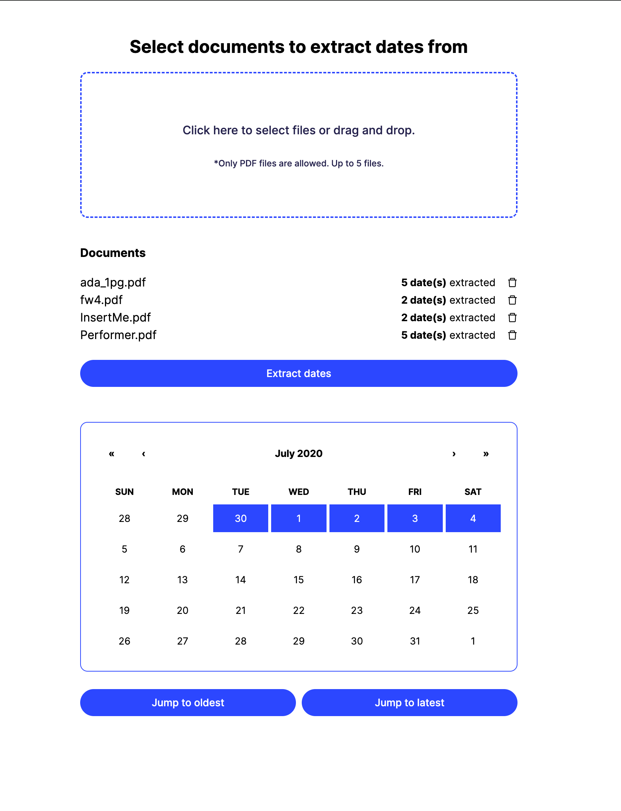

# PDF Date Extractor 📅

Welcome to PDF Date Extractor! This tool helps you effortlessly extract dates from your PDF documents. It's powered by FastAPI on the backend and ReactJS on the frontend, making it a breeze to use.



## Demo ✨

If you want to play around and get a quick demo, the app is deployed [here](https://pdf-date-extractor.vercel.app/).

## Features 🚀

- **Easy Extraction:** Quickly extract dates from your PDF files.
- **User-Friendly Interface:** An intuitive web interface for hassle-free PDF uploads. Either select them via browser file picker or drag and drop them!
- **Clear Display:** View your extracted dates within a text snippet in a calendar widget with a link to the real PDF file.
- **Responsive design:** Access the app from any device, including mobile phones.

## How to Use 📝

1. **Access the Web Interface:** Visit [PDF Date Extractor](https://pdf-date-extractor.vercel.app/) in your browser.
2. **Upload Your PDF:** Use the provided interface to upload your PDF files and hit "Extract dates".
3. **Instant Results:** Your extracted dates will be displayed on the calendar widget. Click on a extracted date to see its text snippet and a link to the PDF.

## Local development 🛠️

### Backend Setup

#### Run manually

```bash
cd server
# Install dependencies
pipenv install
# Run the server
pipenv run uvicorn main:app
```

#### Run as a docker container

```bash
cd server
# Build the image
docker build -t pdf-date-extractor .
# Run the container
docker run -p 8000:8000 pdf-date-extractor
```

### Frontend setup

#### Run manually

```bash
cd client
# Install dependencies
npm install
# Run the app
npm run dev
```

#### Run as a docker container

```bash
cd client
# Build the image
docker build -t pdf-date-extractor-client .
# Run the container
docker run -p 3000:3000 pdf-date-extractor-client
```

## License 📜

This project is licensed under the MIT License. Feel free to use, modify, and share!

Happy extracting! 🎉
